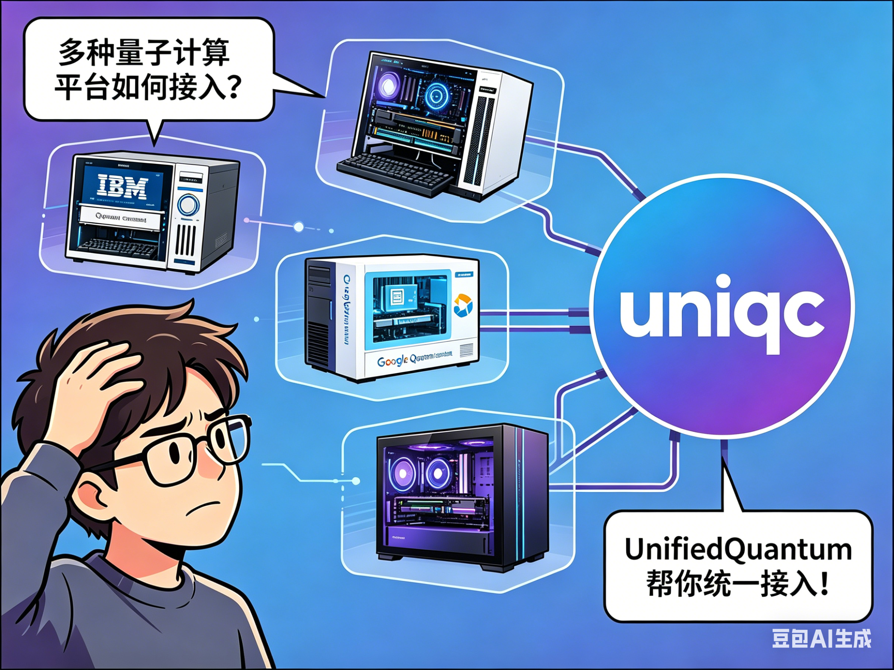

<p align="center">
  
</p>

# UnifiedQuantum

[](https://badge.fury.io/py/unified-quantum)
[](https://codecov.io/github/IAI-USTC-Quantum/UnifiedQuantum)
[](https://github.com/IAI-USTC-Quantum/UnifiedQuantum/actions/workflows/build_and_test.yml)

**UnifiedQuantum** — A unified, non-commercial quantum computing aggregation framework.

UnifiedQuantum is a lightweight Python framework that provides a **unified interface** for quantum circuit construction, simulation, and cloud execution across multiple quantum computing platforms. It aggregates backends including OriginQ, Quafu, and IBM Quantum under one consistent API.

---

## 核心工作流

UnifiedQuantum 围绕一个简洁的工作流设计：**任意方式构建线路 → `uniqc` CLI 统一执行**。

### 1. 安装

```bash
pip install unified-quantum
```

### 2. 构建线路（支持原生 API 或任意第三方工具）

```python
from uniqc.circuit_builder import Circuit

c = Circuit()
c.h(0)
c.cnot(0, 1)
c.measure(0, 1)

# 输出 OriginIR 格式，可供 CLI 使用
open('circuit.ir', 'w').write(c.originir)
```

> 你也可以使用 Qiskit、Cirq 等工具构建线路，只需最终输出 OriginIR 或 OpenQASM 2.0 格式。

### 3. CLI 统一执行

```bash
# 本地模拟
uniqc simulate circuit.ir --shots 1000

# 提交到云端
uniqc submit circuit.ir --platform originq --shots 1000

# 查询任务结果
uniqc result <task_id>
```

---

## 设计理念

UnifiedQuantum 是一个**非商业性**的开源项目，致力于打造 **AI 时代原生**的量子计算应用框架：

- **AI 原生**：专为 AI 工作流设计，无缝集成到现代开发与推理流程中
- **CLI-first**：开箱即用的命令行工具，一条命令完成线路构建、模拟、提交与结果分析
- **聚合**：整合多种量子云平台（OriginQ、Quafu、IBM Quantum），提供统一接口
- **统一**：一致的 API 设计，屏蔽各平台差异
- **透明**：清晰的量子程序组装与执行方式，无隐藏行为
- **轻量**：纯 Python 实现，安装简单，集成方便

> **配套 Skill**：在 [IAI-USTC-Quantum/quantum-computing.skill](https://github.com/IAI-USTC-Quantum/quantum-computing.skill) 中获取 Claude Code 集成指南与 AI 辅助量子编程工作流。

| 线路构建 | 原生 API 或任意工具，输出 OriginIR / QASM2 |
| CLI 执行 | 统一接口：模拟、云端、任务管理 |
| 结果分析 | 原生 Python 结构，易于集成 |

<p align="center">
  
</p>

---

## Features

- **多平台提交**：一个 `submit_task`（或 `uniqc submit`）即可将同一份 OriginIR 发往 OriginQ、Quafu、IBM Quantum，或本地 dummy 模拟器。
- **本地模拟**：自带 OriginIR Simulator、QASM Simulator，支持 statevector / density matrix 两种后端，以及带噪声的变体。
- **算法组件**：内置 HEA、UCCSD、QAOA 等常用 ansatz，可直接用于 VQE / QAOA 研究。
- **PyTorch 集成**：提供 `QuantumLayer`、参数偏移梯度、批处理执行，便于构建混合量子—经典模型。
- **可互操作**：线路既可用原生 API 构建，也可来自 Qiskit、Cirq 等第三方工具，只要最终产出 OriginIR 或 OpenQASM 2.0。
- **同步 / 异步并存**：`submit_task` 立即返回 `task_id`；`wait_for_result` 或 `--wait` 可阻塞至完成。
- **易扩展**：门集、错误模型、平台适配器都按接口组织，添加新后端只需实现一个 adapter。

---

## Installation

### Supported Platforms

- Windows / Linux / macOS

### Requirements

- Python 3.10 – 3.13

### pip（推荐）

```bash
pip install unified-quantum
```

### uv tool（作为独立 CLI 工具安装）

如果只想在命令行用 `uniqc` 而不污染全局环境：

```bash
# 安装
uv tool install unified-quantum

# 带可选依赖
uv tool install "unified-quantum[simulation]"

# 升级 / 卸载
uv tool upgrade unified-quantum
uv tool uninstall unified-quantum
```

`uv tool` 会为 `uniqc` 创建一个独立的虚拟环境并把可执行文件链接到 `~/.local/bin/uniqc`。

### Build from Source

```bash
git clone --recurse-submodules https://github.com/IAI-USTC-Quantum/UnifiedQuantum.git
cd UnifiedQuantum
pip install .
```

**Requirements:**
- CMake >= 3.26
- C++ compiler with C++17 support
- Git submodules (pybind11, fmt)

If system CMake is too old:
```bash
pip install cmake --upgrade
```

**Development mode (using uv, recommended):**

```bash
cd UnifiedQuantum

# Create virtual environment
uv venv .venv && source .venv/bin/activate

# Install build dependencies
uv pip install cmake ninja setuptools setuptools_scm wheel pybind11

# Editable install with all optional dependencies
uv pip install -e ".[all]" --no-build-isolation

# Install TorchQuantum separately
uv pip install "torchquantum @ git+https://github.com/Agony5757/torchquantum.git@fix/optional-qiskit-deps"

# Run tests
pytest uniqc/test/ -v -m "not cloud"
```

**Development mode (using pip):**
```bash
pip install -e . --no-build-isolation
```

### Optional Dependencies

核心依赖（包括 `scipy`）在默认安装中已包含。以下为可选功能依赖：

| 功能 | 安装命令 |
|------|---------|
| OriginQ 云平台 | `pip install unified-quantum[originq]` |
| Quafu 执行后端 | `pip install unified-quantum[quafu]` |
| Qiskit 执行后端 | `pip install unified-quantum[qiskit]` |
| 高级模拟 (QuTiP) | `pip install unified-quantum[simulation]` |
| 可视化 | `pip install unified-quantum[visualization]` |
| PyTorch 集成 | `pip install unified-quantum[pytorch]` |
| 安装所有可选依赖 | `pip install unified-quantum[all]` |

TorchQuantum 后端当前不包含在 PyPI extras 中，需要手动安装：

```bash
pip install unified-quantum[pytorch]
pip install "torchquantum @ git+https://github.com/Agony5757/torchquantum.git@fix/optional-qiskit-deps"
```

不安装 TorchQuantum 不会影响核心功能、QuTiP 模拟、云平台适配器或常规 `uniqc.pytorch` 功能；只有 TorchQuantum 专用后端与示例会在实际使用时提示缺少该依赖。

---

## CLI Quick Reference

```bash
# 查看帮助
uniqc --help

# 本地模拟
uniqc simulate circuit.ir --shots 1000

# 提交到云端（支持 originq / quafu / ibm / dummy）
uniqc submit circuit.ir --platform originq --shots 1000

# 查询任务结果
uniqc result <task_id>

# 配置云平台 Token
uniqc config init
uniqc config set originq.token YOUR_TOKEN

# 也可以用 python -m 调用（等价于 uniqc）
python -m uniqc simulate circuit.ir
```

---

## Examples

📁 [examples/](examples/README.md) — Runnable demonstrations

### Getting Started

| Example | Description |
|---------|-------------|
| [Circuit Remapping](examples/getting-started/1_circuit_remap.py) | Build a circuit and remap qubits for real hardware |
| [Dummy Server](examples/getting-started/2_dummy_server.py) | Submit tasks to the local dummy simulator |
| [Result Post-Processing](examples/getting-started/3_result_postprocess.py) | Convert and analyze results |

### Algorithms

| Example | Description |
|---------|-------------|
| [Grover Search](examples/algorithms/grover.md) | Unstructured search with quadratic speedup |
| [Quantum Phase Estimation](examples/algorithms/qpe.md) | Eigenvalue phase estimation |

---

## Documentation

📖 [GitHub Pages](https://iai-ustc-quantum.github.io/UnifiedQuantum/)

### Release Notes

- 版本变化总览：<https://iai-ustc-quantum.github.io/UnifiedQuantum/source/releases/index.html>

---

## Status

🚧 Actively developing. API may change.
